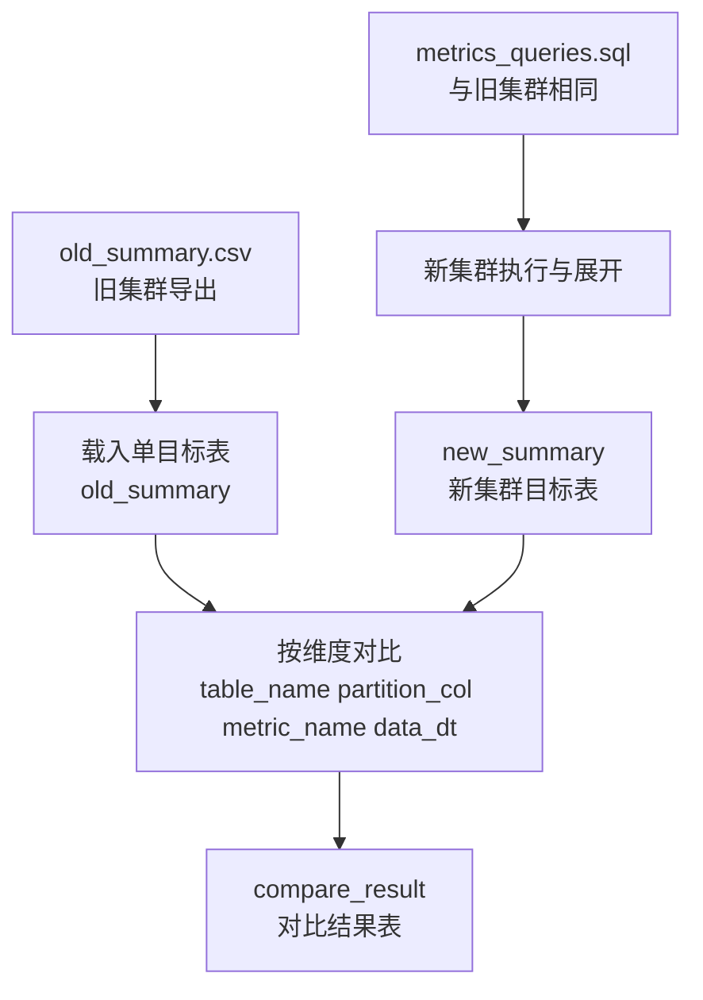

## 关联文档

- 基线流程与字段约定见：[hive-sql-plan_c6ddd99b.plan.md](hive-sql-plan_c6ddd99b.plan.md)（阶段一 SQL 模板、阶段二展开字段含 `partition_col` 等）。
- 旧集群导出示例列：`table_name`、`partition_col`、`metric_name`、`value`、`computed_at`、`data_dt`（见 `old/output/old_summary.csv`）。

## 目标

在**不重复发明指标口径**的前提下，扩展为「旧集群结果落表 + 新集群同口径落表 + 对比落表」三条能力：

1. **读取旧集群输出的 CSV，写入单目标表**：将旧集群产出的长表 CSV 作为数据源，导入或加载到 Hive（或等价引擎）中的**一张**目标表（下称 `old_summary` 表，实际库表名可配置）。
2. **新集群执行相同语句，直接写入目标表**：新集群使用**同一份** `metrics_queries.sql`（及相同 `data_dt` 替换规则），执行后按与旧集群**相同**的「宽表 → 长表展开」逻辑，写入新集群**单目标表**（下称 `new_summary` 表，可配置）。
3. **新旧集群指标值对比并写入对比结果表**：以统一维度对齐两行结果，计算差异与状态，写入对比表（下称 `compare_result` 表，可配置）。

## 表结构与对齐键

### 旧/新摘要表（长表，与 CSV 一致）

建议字段（与当前展开结果一致）：

- `table_name` STRING
- `partition_col` STRING
- `metric_name` STRING
- `value` STRING（或 DOUBLE，若统一数值解析；规划阶段允许 STRING 与旧 CSV 一致）
- `computed_at` TIMESTAMP
- `data_dt` STRING

可选扩展（若需要批次追踪）：`run_id` STRING、`cluster` STRING、`env` STRING。

### 对比结果表（建议最小集）

对齐键 + 对比字段：

- 对齐键：`table_name`、`partition_col`、`metric_name`、`data_dt`
- `old_value` STRING（或 DOUBLE）
- `new_value` STRING（或 DOUBLE）
- `diff` DOUBLE（如 `cast(new as double) - cast(old as double)`，NULL 安全处理）
- `status` STRING（`PASS` / `FAIL` / `MISSING_OLD` / `MISSING_NEW` 等）
- `reason` STRING（可选，记录解析失败、类型不一致等）
- `compared_at` TIMESTAMP
- 可选：`run_id` STRING

> 若项目已有 DDL（如历史 `create_new.sql`），实现时以仓库内实际 DDL 为准，本计划仅约定语义。

## 功能 1：旧集群 CSV → 单目标表

- **输入**：旧集群导出的 CSV/TSV（路径可配置，默认指向 `old/output/old_summary.csv` 同类格式）。
- **行为**：
  - 校验表头与预期列一致。
  - 写入方式二选一（实现时择一或都支持）：
    - **Hive**：`LOAD DATA` / `INSERT` / 外部表指向文件；
    - **本地脚本**：pandas 读入后通过 JDBC/Thrift 批量写入 Hive 表。
- **输出**：`old_summary`（表名可配置）中可查询到与 CSV 等价的数据。

## 功能 2：新集群执行相同语句 → 单目标表

- **输入**：与旧集群相同的 `metrics_queries.sql`、`--data-dt`，以及新集群连接配置（参考旧计划中的 `env_config.json` 的 `clusters.new`）。
- **行为**：
  - 复用阶段二逻辑：分号拆分、替换 `{{data_dt}}`、执行、宽表按列展开为长表。
  - **落地方式**：将展开后的 DataFrame **直接写入** `new_summary`（表名可配置），而不是仅写本地 CSV（可同时保留 CSV 作为审计副本，可选）。
- **输出**：`new_summary` 中结构与功能 1 中长表字段一致。

## 功能 3：新旧对比 → 对比结果表

- **输入**：`old_summary` + `new_summary`（或同结构视图），以及本次 `data_dt`（及可选 `run_id`）。
- **对齐规则**：
  - JOIN ON：`table_name`、`partition_col`、`metric_name`、`data_dt`。
- **对比规则（建议默认）**：
  - 双方 `value` 均可解析为数值：比较差值与阈值（阈值可配置，默认 0 或 epsilon）。
  - 任一方缺失：写入 `MISSING_*` 状态。
  - `NULL` 与空字符串：统一规范化后再比。
- **输出**：写入 `compare_result` 表，一行表示一个 `(table_name, partition_col, metric_name, data_dt)` 的对比结论。

## 交付物（规划层面）

- 新脚本或扩展现有脚本（命名待定），例如：
  - `ingest_old_summary.py`（CSV → `old_summary`）
  - `run_new_cluster_metrics.py`（执行 + 写 `new_summary`）
  - `compare_cluster_metrics.py`（读两表 → 写 `compare_result`）
- 或合并为单一 CLI，子命令：`ingest-old`、`run-new`、`compare`。
- 配置：`env_config.json` 中增加 `new` 集群与三张表库名、表名。

## 运行示例（规划）

```bash
# 1) 旧集群 CSV 导入 Hive 目标表
python scripts/ingest_old_summary.py --csv old/output/old_summary.csv --table validation_db.old_summary

# 2) 新集群执行同 SQL 并写入目标表
python scripts/run_new_cluster_metrics.py --sql-file old/output/metrics_queries.sql --data-dt 2024-01-01 --table validation_db.new_summary

# 3) 对比并写入对比表
python scripts/compare_cluster_metrics.py --data-dt 2024-01-01 --old-table validation_db.old_summary --new-table validation_db.new_summary --compare-table validation_db.compare_result
```

## 结构关系图


