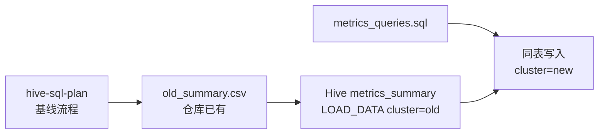

## 目标

- 基线流程与字段约定见：[hive-sql-plan_c6ddd99b.plan.md](hive-sql-plan_c6ddd99b.plan.md)。
- `new/hive_validator.py`（或等价脚本）：
  1. 旧集群 **已有** CSV → 经 **LOAD DATA** 写入 Hive **统一结果表**（带集群区分字段）。
  2. 新集群执行同 SQL → 写入**同一张表**（同一区分字段取另一取值）。

## 阶段1：旧集群 CSV 载入统一结果表

### 1. 明确输入/输出

- 输入：**CSV 已存在于仓库**（路径可配置，例如 `old/output/old_summary.csv` 或 `new/output/old_summary.csv`，与 `env_config.json` 中 `paths.old_summary_csv` 对齐），表头与基线展开一致：
  - `table_name`、`partition_col`、`metric_name`、`value`、`computed_at`、`data_dt`
- 输出：写入 Hive **单张**结果表（名称由配置指定，例如 `validation_db.metrics_summary`），并增加**集群区分字段**（建议列名 `cluster`，取值 `**old`**；若需批次可加 `run_id`/`batch_id` 等扩展列）。

### 2. 行为说明

- 校验表头；写入前可按 `data_dt` + `cluster` 做覆盖/追加策略（实现时明确一种默认行为，如分区覆盖或先删后插）。
- **写入方式：统一使用 Hive `LOAD DATA`**（`LOCAL INPATH` 或 `INPATH` 视 HiveServer 与文件位置而定；若文件需先放到 HDFS，在实现中明确一步上传再 `LOAD DATA INPATH`）。

## 阶段2：新集群执行相同语句写入统一结果表

### 1. 明确输入/输出与 CLI

- 输入：同一份 `metrics_queries.sql`、`--data-dt`，`clusters.new` 连接配置。
- 输出：展开后的长表写入**与阶段1相同的 Hive 表**，**集群区分字段取 `new`**（如 `cluster='new'`）。

### 2. 执行与展开逻辑

- 复用基线：分号拆分、`{{data_dt}}` 替换、执行、宽表动态展开。
- 仅 `cluster` 取值与阶段1不同；其余列与 CSV/基线一致。

## 交付物

- 开发目录：`new/`
- 脚本：`new/hive_validator.py`（子命令如 `ingest-old`、`run-new`）
- 配置：`new/env_config.json`（含 **单 Hive 结果表**名、`cluster` 取值约定、**CSV 路径**）

## 运行示例

- 载入旧集群 CSV（`LOAD DATA` 写 Hive 统一表，`cluster=old`）：
  - `python new/hive_validator.py ingest-old --csv old/output/old_summary.csv --data-dt 2024-01-01`
- 新集群执行并写同表（`cluster=new`）：
  - `python new/hive_validator.py run-new --sql-file old/output/metrics_queries.sql --data-dt 2024-01-01`

## 配置说明

### env_config.json（示意，实现时与代码对齐）

```json
{
  "clusters": {
    "old": {
      "use_ssh": true,
      "ssh_host": "172.20.10.6",
      "ssh_port": 22,
      "ssh_user": "atguigu",
      "hive_host": "localhost",
      "port": 10000,
      "username": "atguigu"
    },
    "new": {
      "use_ssh": true,
      "ssh_host": "172.20.10.7",
      "ssh_port": 22,
      "ssh_user": "atguigu",
      "hive_host": "localhost",
      "port": 10000,
      "username": "atguigu"
    }
  },
  "validation_db": "validation_db",
  "tables": {
    "metrics_summary": "metrics_summary"
  },
  "cluster_labels": {
    "old": "old",
    "new": "new"
  },
  "paths": {
    "old_summary_csv": "output/old_summary.csv"
  }
}
```

- `tables.metrics_summary`：唯一 Hive 结果表（新旧共用）。
- `paths.old_summary_csv`：旧集群 CSV（已存在文件）的相对/约定路径，供 `ingest-old` 与 `LOAD DATA` 解析使用。

## 结构关系图




