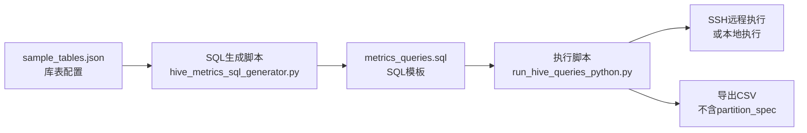

## 目标

- `old/hive_metrics_sql_generator.py`：读取库表配置 JSON（`old/sample_tables.json`），生成 `output/metrics_queries.sql`（SQL 模板）。
- `old/run_hive_queries_python.py`：读取一个 `.sql` 文件（多条语句以分号分隔），执行每条 SQL，用 `--data-dt` 替换占位符，直接按结果列展开导出 CSV（不含 partition_spec、metric_expr）。

## 阶段1：SQL 生成脚本规划（生成模板）

### 1. 明确输入/输出

- 输入：`old/sample_tables.json`，结构如下（**所有 key 均必填**，`partition_cols` 值可为空数组 `[]`）：
  - `tables[].name`（`db.table`，必填）
  - `tables[].partition_cols`（分区列数组，必填，可为 `[]`）
  - `tables[].fields[]`（必填，元素为 `{name, type}`，**仅包含 decimal 类型**）
- 输出到 `--output-dir`：
  - `metrics_queries.sql`：多条 `SELECT ... FROM db.table`，每表一行宽表结果。

### 2. SQL 模板内容

- 占位符：**仅 `{{data_dt}}`**，用于输出列 `data_dt` 及可选 WHERE 条件。
- 分区字段输出列：**直接输出分区字段名作为字符串**，统一别名为 `partition_col`（如分区字段为 `dt`，则输出为 `'dt' as partition_col`；若为空则输出空字符串别名）。
- WHERE 条件：
  - 若 `partition_cols` 不为空：`WHERE <第一个分区列> = '{{data_dt}}'`
  - 若 `partition_cols` 为空：无 WHERE 条件。
- 聚合：metrics 为 `count(1)` 及各 decimal 的 `sum(...)`，无需 GROUP BY。
- 执行引擎：自动添加 `set hive.execution.engine=mr`

### 3. 指标列生成规则

- 每表必有 `row_count`：`count(1)`。
- 每个 decimal 字段：`sum(cast(col as decimal(38,2)))`，列名为 `原字段名_sum`（如 `condition_amount_sum`）。

## 阶段2：SQL 执行脚本规划（执行 + 整理导出 CSV）

### 1. 明确输入/输出与 CLI

- 输入：**一个 `.sql` 文件**，内含多条语句，以分号 `;` 分隔。
- 执行参数：
  - `--sql-file`：`.sql` 文件路径。
  - `--data-dt`：替换模板中的 `{{data_dt}}`。
  - `--output-csv`：输出 CSV 路径，默认 `old_summary_data.csv`。
  - `--cluster`：集群名称，默认 `old`。
- 输出：`--output-csv`

### 2. 读取并拆分 SQL 文件

- 读取该 `.sql` 文件，按分号 `;` 拆分出每条语句。

### 3. 替换占位符并执行 Hive

- 对每条语句执行前，将 `{{data_dt}}` 替换成 `--data-dt` 传入的值。
- 执行前自动添加 `set hive.execution.engine=mr`
- 支持两种执行模式（通过 `env_config.json` 中 `use_ssh` 配置）：
  - `use_ssh: true`：SSH 远程执行
  - `use_ssh: false`：本地直接执行
- 输出解析：按 tab-separated 构造 DataFrame，跳过提示符行，取首行 header + 数据行。

### 4. 中间 DataFrame 与展开逻辑

- 每条语句执行结果是一个独立的 DataFrame，**字段数量因表/指标不同而不一致，无法直接纵向拼接**。
- 对每条语句得到的 DataFrame，直接按列动态展开：
  - 保留基础列：`table_name`、`partition_col`、`computed_at`、`data_dt`。
  - 其余列均视为 metric 列（如 `row_count`、`condition_amount_sum`）。
  - 每个 metric 列展开为一行，写入最终结果。

### 5. 整理为最终 CSV 并导出

- 结果行字段（**不含 partition_spec**）：
  - `table_name`：从查询输出取。
  - `partition_col`：从查询输出取（分区字段名）。
  - `metric_name`：来自 DataFrame 的指标列名。decimal 字段为 **原字段名 + `_sum`**（如 `condition_amount_sum`）；内置 `row_count` 即 `row_count`。
  - `value`：来自 DataFrame 对应 metric 列。
  - `computed_at`、`data_dt`：从 DataFrame 取。
- 输出：按 `sep='\t'` 写入 `output-csv`。

## 交付物

- 开发目录：`old/`
- 脚本文件：
  - `old/hive_metrics_sql_generator.py`
  - `old/run_hive_queries_python.py`
- 配置文件：
  - `old/sample_tables.json`
  - `old/env_config.json`
- 运行时生成：
  - `old/output/metrics_queries.sql`
  - `old/output/old_summary.csv`

## 运行示例

- 生成：
  - `python old/hive_metrics_sql_generator.py --table-list old/sample_tables.json --output-dir old/output`
- 执行：
  - `python old/run_hive_queries_python.py --sql-file old/output/metrics_queries.sql --data-dt 2024-01-01 --output-csv old/output/old_summary.csv`

## 配置说明

### env_config.json

```json
{
  "clusters": {
    "old": {
      "use_ssh": true,
      "ssh_host": "172.20.10.6",
      "ssh_port": 22,
      "ssh_user": "atguigu",
      "hive_host": "localhost",
      "port": 10000,
      "username": "atguigu"
    }
  }
}
```

- `use_ssh: true`：本地测试时使用 SSH 远程执行
- `use_ssh: false`：上线后使用本地直接执行

## 结构关系图


