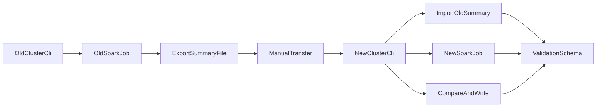

## 目标与约束

- **校验内容**：
  - **每表数据量**：总行数（可扩展到分区行数）。
  - **关键指标**：如金额 `sum`、`count`、`min/max` 等（按配置）。
  - **主键重复**：按配置的 `keys` 统计重复数量/重复率（规模大时需分区/分桶聚合）。
- **集群隔离**：旧集群只运行“计算并导出摘要”的脚本；摘要文件由人工传输到新集群；新集群负责“导入+计算+对比+落库”。
- **规模大**：默认走 **Spark SQL/PySpark 分布式计算**，避免单机全表扫描拉取。
- **对比规则**：你选择 **严格相等**（数值精度需在计算侧统一 `cast/round`，否则会出现浮点/decimal 表现差异）。

## 总体架构（CLI 驱动，作业在 Spark 上跑）

## 后端（脚本/作业）需要实现的功能

### 1) 统一“校验规则配置”

- **输入**：一份 YAML（你选的方案），每张表一段配置。
- **建议字段**（核心）：
  - `table`: `db.table`
  - `where`: 过滤条件（常用分区 `dt='2026-03-03'` 或区间）
  - `keys`: 主键/去重键列表（可空，空则跳过重复校验）
  - `metrics`: 指标列表（例如 `sum(amount)`、`count(1)`）
  - `spark`: 可选执行参数（并行度、shuffle 分区数）

### 2) 旧集群：计算摘要并导出文件（只读）

- **功能**：
  - 读取 YAML → 为每表生成 Spark SQL → 产出“摘要结果 DataFrame”。
  - 写出到文件（推荐 **Parquet**，兼容性好、体积小）。
- **输出文件内容**：至少包含 `run_id、table_name、check_type、metric_name、value、computed_at、where_hash`。

### 3) 新集群：导入旧摘要到“校验库”

- **功能**：
  - 读取人工传输来的 Parquet/CSV → 落到新集群独立校验库（Hive schema）。
  - 保留 `run_id` 分区，支持多次跑、多批次迁移并存。

### 4) 新集群：计算新摘要并写入“校验库”

- **功能**：同旧集群计算逻辑（同一份 YAML/同一套 SQL 生成器），写入 `new_summary` 表。

### 5) 新集群：旧新对比并写入结果表

- **对比维度**：`run_id + table_name + check_type + metric_name (+ partition)`
- **结果**：`PASS/FAIL`、`old_value/new_value/diff`、失败原因（缺失/不相等/为空等）。

### 6) 运行形态（CLI）

- **命令建议**（同一代码仓可复用，靠 `--mode old|new` 区分）：
  - `validate old --config rules.yml --run-id xxx --out /path/old_summary.parquet`
  - `validate new import --run-id xxx --in /path/old_summary.parquet`
  - `validate new compute --config rules.yml --run-id xxx`
  - `validate new compare --run-id xxx`
  - `validate new report --run-id xxx --out report.html`（可选，纯离线报告）

## 结果落库（新集群独立校验库）表设计（Hive 表）

- `**validation_db.runs**`：任务元信息（run_id、迁移批次、发起人、开始/结束、状态、配置hash）。
- `**validation_db.old_summary**`：旧集群摘要（按 `run_id` 分区）。
- `**validation_db.new_summary**`：新集群摘要（按 `run_id` 分区）。
- `**validation_db.compare_result**`：对比结果（按 `run_id` 分区，可再按 `table_name` 二级分桶/分区）。

> 说明：你选的是“新集群独立数据库”，对 Hive/Spark 场景通常就是单独建一个 **校验 schema（如 `validation_db`）**；如你们更偏向运维库（MySQL/Postgres）存结果，也可把 `runs/compare_result` 放外部库，`old/new_summary` 仍放 Parquet/Hive 表。

## 关键算法与性能策略（大规模必备）

- **行数**：`count(1)`；若按分区校验，用 `group by partition_cols` 输出分区级别行数。
- **指标**：统一对金额等字段做 `cast(decimal(p,s))` 再 `sum`，避免浮点差异；你要求严格相等时尤其重要。
- **主键重复**：
  - 计算：`count(1) - count(distinct keys)` 或 `select keys, count(*) c group by keys having c>1` 再聚合重复行数。
  - 大表优化：优先按分区算；必要时启用 `spark.sql.adaptive.enabled`、合理 `shuffle partitions`。
- **可选增强（不改变你当前三项口径）**：为每表/每分区增加“校验指纹”（例如对关键列做 `xxhash64` 聚合/分桶 checksum），在行数一致但数据错位时更敏感。

## 前端需要实现什么？（你当前选 CLI-only）

- **当前最小集**：不做 Web 前端。
- **可选交付（成本低、收益高）**：
  - 生成一份静态 `report.html`（或 markdown）展示：总体通过率、失败表列表、差异明细、可下载旧新摘要。
- **如果未来要页面化**（不是本次必须）：
  - 页面发起 run、查看 run 列表/详情、失败钻取、导出报告、权限控制。

## 推荐技术栈

- **计算引擎**：PySpark + Spark SQL（在两边集群都可跑）。
- **CLI**：Python `typer`/`argparse`（单文件也能跑，后续易扩展）。
- **配置**：YAML（`pyyaml`）。
- **存储**：Parquet（摘要文件 + Hive 外部表/托管表）。
- **日志/追溯**：标准 logging + 将 run 元信息写 `validation_db.runs`。

## 实施步骤（可并行推进）

- **定义校验库与表结构**：在新集群建 `validation_db`，创建四张表（runs/old_summary/new_summary/compare_result），确定分区字段。
- **落地 YAML 规则模板**：先挑 2-3 张代表性大表跑通（含 keys、sum 金额）。
- **实现旧集群 CLI**：读取规则→计算→导出 Parquet。
- **实现新集群 CLI**：导入旧摘要→计算新摘要→对比落库→生成报告。
- **性能与稳定性**：对大表加分区级校验、并发控制、失败重跑（按表/分区粒度）。

## 需要你补充/我已做的默认假设

- **默认假设**：两边都能运行 PySpark 作业，且能访问各自 Hive Metastore/表数据；人工传输的文件格式为 Parquet。
- **后续你补充即可**：
  - 每张表的分区字段（如 `dt`）是否统一；
  - 金额等字段是否为 `decimal`，若有 `double` 是否允许统一 cast；
  - `keys` 是否总能提供（没有 keys 的表只做行数/指标）。

